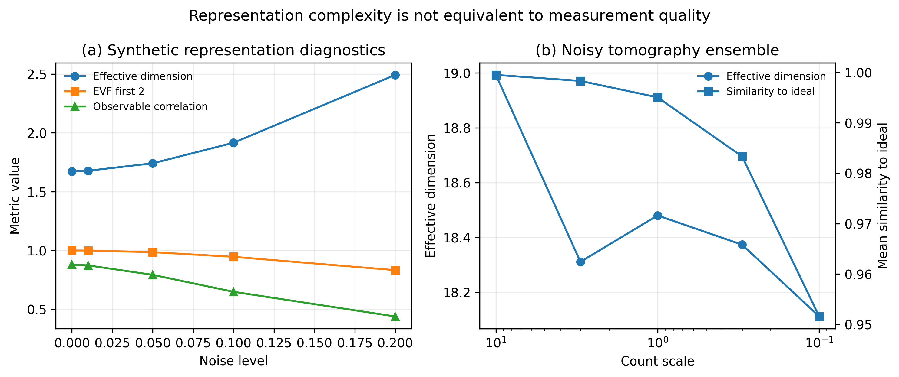
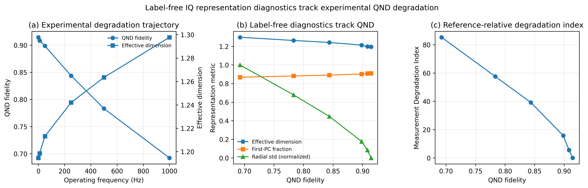
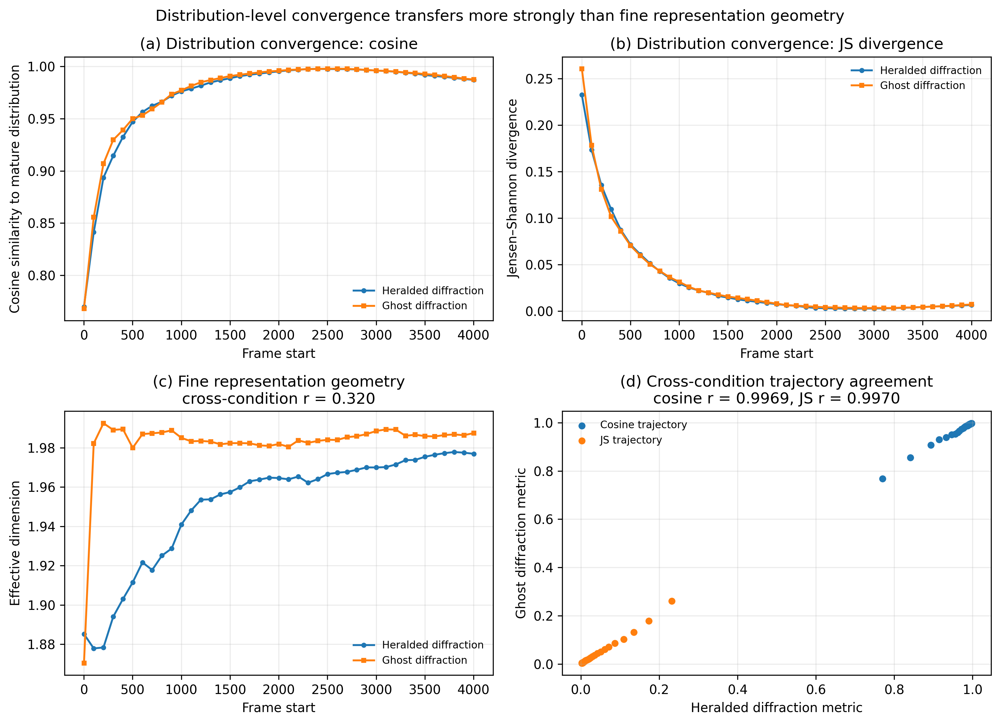
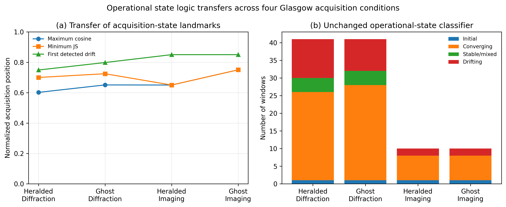
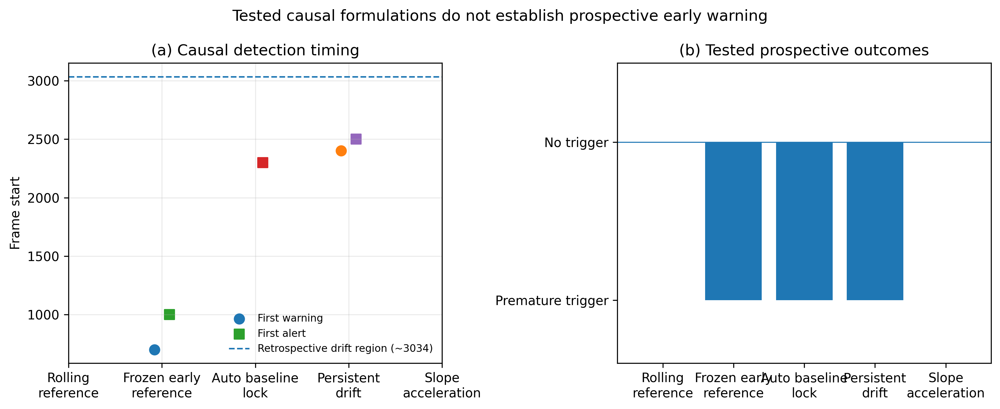

# QMS Platform: Representation Diagnostics, Measurement Convergence, and Cross-Condition Transfer in Real Quantum Measurements

**Srikar R.**
Independent Researcher
ORCID: 0009-0002-9398-0847

---

## Abstract

Quantum measurement pipelines often move directly from raw detector outputs to reconstruction or downstream inference without explicitly characterizing the structure, stability, and transferability of the measurement representation itself. Here we extend the QMS Platform with representation diagnostics, convergence analysis, and operational measurement-state classification, and evaluate these components across synthetic studies, noisy quantum-state tomography ensembles, real superconducting-qubit IQ measurements, and raw spatial single-photon detector acquisitions.

The representation layer includes covariance-spectrum analysis, participation-ratio effective dimension, explained-variance measures, and observable-sensitivity diagnostics. Synthetic and tomography experiments show that increased representation complexity does not necessarily imply increased measurement usefulness: noise can increase apparent dimensionality while reducing correlation with the underlying control variable or degrading reconstruction consistency. In six superconducting-qubit operating conditions, several label-free IQ diagnostics varied monotonically with reported QND-fidelity degradation, including effective dimension, first-principal-component fraction, anisotropy, covariance determinant, and radial-distribution statistics.

For raw Glasgow single-photon acquisitions, distribution-level convergence was quantified using cosine similarity and Jensen-Shannon divergence relative to the mature acquisition distribution. Across Heralded and Ghost Diffraction measurements, convergence trajectories were highly reproducible, with cross-condition correlations of approximately 0.9969 for cosine-to-final and 0.9970 for JS-divergence-to-final. In contrast, fine representation-geometry trajectories were substantially less reproducible across those conditions. An unchanged operational state-classification rule transferred across four Glasgow acquisitions spanning heralded/ghost and diffraction/imaging conditions and consistently identified a late-acquisition departure following prior convergence, with normalized first-drift positions between approximately 0.750 and 0.851.

Prospective causal early-warning capability was not established. Rolling-reference, frozen-baseline, stability-lock, persistence, and slope-acceleration formulations either adapted to the gradual change, produced premature alerts, or produced no warning. These results support a measurement-assurance architecture in which representation structure, convergence, observability, reconstruction, and health interpretation are treated as distinct layers. The present evidence establishes cross-condition transfer within the tested Glasgow platform, but does not establish universal detector-health calibration, universal drift timing, causal failure prediction, universal representation geometry, or cross-laboratory generality.

---

## 1. Introduction

Quantum measurement systems rarely fail in only one way. A measurement can be noisy but still observable, stable but informationally incomplete, converged but biased, or high dimensional without being useful for the target inference. These distinctions matter because many quantum workflows move quickly from raw detector outputs to reconstruction, estimation, or classification, while giving comparatively little attention to the structure and temporal behavior of the measurement representation itself.

The original QMS framework addressed this problem from the perspective of measurement observability and reconstruction assurance. In that formulation, the central questions were whether the available measurement operator contained sufficient information to recover the target state, how conditioning and null-space structure affected that recovery, and how reconstruction error could be decomposed into structural information loss and noise amplification. That framework established a separation between measurement completeness and reconstruction quality.

The present work extends QMS one layer upstream. Before asking whether a target can be reconstructed from a measurement, we ask what structure is present in the measurement representation, how that structure evolves during acquisition, and which diagnostic behaviors remain stable across changes in measurement condition. This motivates explicit separation between representation diagnostics, convergence diagnostics, observability diagnostics, reconstruction assurance, and downstream measurement-health interpretation.

This separation is important because the same representation statistic can have different meanings in different physical settings. For example, increasing effective dimension may indicate loss of cluster separability in one system while accompanying the accumulation of a richer spatial distribution in another. A representation metric therefore cannot be interpreted as intrinsically favorable or unfavorable without reference to the measurement objective and acquisition context.

To investigate these questions, we evaluate the extended QMS framework across synthetic representation experiments, noisy quantum-state tomography ensembles, real superconducting-qubit IQ measurements, and raw single-photon spatial detector data. The superconducting-qubit experiments test whether label-free representation diagnostics track degradation across operating conditions. The Glasgow single-photon experiments test whether representation geometry, distribution-level convergence, and an unchanged operational state-classification rule transfer across related acquisition conditions.

The principal empirical result is a separation between fine representation geometry and distribution-level convergence. Across the two Glasgow diffraction acquisitions, cosine-to-final and Jensen-Shannon-divergence-to-final trajectories are highly correlated, whereas effective-dimension and first-principal-component trajectories are much less reproducible. The same operational state-classification logic also transfers across four Glasgow acquisitions spanning heralded and ghost measurements and diffraction and imaging conditions. However, causal early-warning experiments do not establish prospective prediction of the late-acquisition transition.

The contribution of this work is therefore not a universal detector-health rule. Rather, it is an experimentally tested measurement-assurance decomposition in which representation structure, convergence behavior, observability, reconstruction, and interpretation are treated as distinct quantities that require separate validation.

### 1.1 Measurement assurance beyond reconstruction

The reliability of a quantum measurement cannot be inferred from reconstruction output alone. A reconstruction may look numerically plausible even when the underlying measurement is poorly conditioned, incomplete, drifting, or dominated by noise-induced variation. Conversely, a measurement can be structurally rich while remaining difficult to interpret if the additional variation is unrelated to the target observable.

This motivates a broader notion of measurement assurance: the measurement should be characterized before, during, and after reconstruction. The relevant questions include whether the raw representation has stable structure, whether the acquisition is approaching a mature distribution, whether the target degrees of freedom are observable, whether the reconstruction method respects physical constraints, and whether any derived health interpretation has been independently calibrated.

### 1.2 Representation, convergence, and observability as distinct layers

Representation, convergence, and observability answer different questions. Representation diagnostics describe the structure of variation in the measured data. Convergence diagnostics describe whether the empirical measurement distribution is approaching or departing from a reference distribution. Observability describes whether the measurement operator preserves enough independent information to recover the target. Reconstruction assurance then evaluates how that information is converted into an estimated state or parameter.

These layers are related but not interchangeable. A high-dimensional representation need not be highly observable. A converged distribution need not contain enough information for unique reconstruction. An observable measurement can still exhibit temporal drift. Separating these layers prevents a single diagnostic quantity from being overloaded with multiple physical meanings.

### 1.3 Contributions

This work makes the following contributions. First, it adds scale-invariant representation diagnostics to QMS, including covariance-spectrum analysis, participation-ratio effective dimension, explained-variance fraction, and observable sensitivity. Second, it demonstrates through synthetic and tomography experiments that apparent representation complexity is not equivalent to measurement usefulness. Third, it evaluates representation diagnostics on real superconducting-qubit IQ measurements across six operating conditions. Fourth, it applies the same representation architecture to raw spatial single-photon measurements. Fifth, it quantifies cross-condition transfer of convergence trajectories and fine representation geometry. Sixth, it tests an unchanged operational state-classification rule across four Glasgow acquisition conditions. Finally, it reports negative causal-drift experiments explicitly, showing that retrospective transition structure does not by itself establish prospective early-warning capability.

---

## 2. QMS Measurement-Representation Framework

### 2.1 Layered architecture

The extended QMS architecture treats measurement assurance as a sequence of related but distinct diagnostic layers:

raw measurement
    ->
representation diagnostics
    ->
convergence and reference diagnostics
    ->
operational state classification
    ->
observability diagnostics
    ->
reconstruction assurance
    ->
error decomposition
    ->
measurement-state interpretation

The representation layer characterizes statistical structure in the raw or minimally processed measurement data. The convergence layer evaluates temporal or acquisition-order evolution relative to a reference distribution. Operational state classification converts selected convergence trends into descriptive states such as converging, stable_or_mixed, or drifting. Observability analysis then asks whether the measurement operator contains sufficient independent information for the target inference. Reconstruction assurance evaluates the estimator, including physicality and residual structure, while error decomposition separates structural information loss from noise amplification.

The purpose of this layered organization is not to imply a universal processing order for every quantum experiment. Rather, it provides a conceptual separation that prevents one diagnostic quantity from being interpreted simultaneously as representation complexity, information completeness, reconstruction quality, and detector health.

### 2.2 Covariance-spectrum diagnostics

Let the measurement representation consist of \(N\) samples \(x_i \in \mathbb{R}^d\), assembled into a matrix \(X \in \mathbb{R}^{N \times d}\). After centering the samples, the empirical covariance matrix is

\[
C = \frac{1}{N-1} X_c^{\mathsf T} X_c,
\]

where \(X_c\) denotes the centered measurement matrix. Let the ordered eigenvalues of \(C\) be

\[
\lambda_1 \ge \lambda_2 \ge \cdots \ge \lambda_d \ge 0.
\]

The covariance spectrum provides a compact description of how measurement variance is distributed across orthogonal directions in representation space. A strongly concentrated spectrum indicates that most measured variation lies in a small number of directions, whereas a flatter spectrum indicates that variation is distributed more broadly.

In QMS, the covariance spectrum is treated as a representation descriptor rather than a direct measure of measurement quality. The same spectral change can carry different physical meaning depending on whether the measured system is forming clusters, accumulating a spatial distribution, or responding to increased noise.

### 2.3 Participation-ratio effective dimension

The participation-ratio effective dimension is defined from the covariance-spectrum eigenvalues as

\[
d_{\mathrm{eff}}
=
\frac{\left(\sum_i \lambda_i\right)^2}
{\sum_i \lambda_i^2}.
\]

This quantity is bounded between 1 and the number of nonzero spectral components. It approaches 1 when variance is concentrated in a single dominant direction and increases as variance is distributed more evenly across multiple directions.

Because both numerator and denominator scale quadratically under multiplication of all eigenvalues by the same positive factor, the participation ratio is invariant to global covariance scaling:

\[
\lambda_i \rightarrow a\lambda_i
\quad \Rightarrow \quad
d_{\mathrm{eff}} \rightarrow d_{\mathrm{eff}}.
\]

This scale invariance is important when comparing measurement representations whose absolute amplitudes differ. However, effective dimension should not be interpreted as an intrinsic measure of detector health or information quality. Increased effective dimension can result from physically meaningful structure, from accumulation of additional measurement support, or from noise-induced spreading.

### 2.4 Explained-variance fraction

The explained-variance fraction of the first \(k\) covariance components is

\[
F_k
=
\frac{\sum_{i=1}^{k}\lambda_i}
{\sum_{i=1}^{d}\lambda_i}.
\]

For \(k=1\), this quantity is the first-principal-component fraction used in several real-measurement experiments. More generally, \(F_k\) measures the concentration of the covariance spectrum in its leading directions.

Effective dimension and explained-variance fraction are related but not redundant. Effective dimension provides a global measure of spectral spread, whereas \(F_k\) provides a direct measure of how much variance is captured by a selected leading subspace. Their joint use allows QMS to distinguish highly concentrated representations from representations whose variance is distributed across multiple directions.

### 2.5 Observable sensitivity

When an external control variable, operating parameter, or reported performance quantity is available, QMS can assess candidate observables by measuring how sensitively they respond to that variable. For a diagnostic quantity \(m\) and control variable \(u\), observable sensitivity can be summarized using association measures such as Pearson or Spearman correlation,

\[
r_{m,u} = \mathrm{corr}(m,u).
\]

This does not establish causality. It instead asks whether the candidate diagnostic changes systematically with a known operating condition or reported performance measure.

This distinction is important in the superconducting-qubit analysis, where several label-free IQ metrics are compared with reported QND fidelity. Strong correlation provides convergent evidence that the representation diagnostic tracks the same operating-condition degradation, but the reported fidelity is not treated as independent causal ground truth.

### 2.6 Representation versus observability

Representation diagnostics and observability diagnostics operate on different mathematical objects and answer different scientific questions. Representation diagnostics characterize the empirical geometry or distribution of measured samples. Observability diagnostics characterize the measurement operator and determine whether target degrees of freedom can, in principle, be recovered from the available measurement configuration.

For a linear measurement model

\[
b = A x + \epsilon,
\]

the representation layer characterizes the structure of the observed data \(b\), while observability is governed by properties of \(A\), including rank, conditioning, and null-space structure. A representation may therefore appear stable or low dimensional even when \(A\) is rank deficient. Conversely, a full-rank measurement operator may produce a noisy or temporally unstable representation.

This separation is retained throughout QMS. Representation diagnostics can identify structure worth monitoring, convergence diagnostics can identify acquisition-state changes, and observability analysis can determine recoverability, but none of these quantities alone establishes detector health or reconstruction validity.

---

## 3. Experimental Design

### 3.1 Synthetic representation experiments

The synthetic representation experiments were designed to test whether covariance-based representation metrics behave in an interpretable manner under controlled degradation.

In QMS-REP-001, a four-channel synthetic measurement representation was generated with a known control-dependent structure and progressively increasing Gaussian noise. For each noise level, QMS computed covariance-spectrum diagnostics, participation-ratio effective dimension, explained-variance concentration, and correlation between a candidate measurement observable and the underlying control variable.

The purpose of the experiment was not to model a specific detector. It was to isolate a general failure mode: increasing noise can distribute variance across additional directions and therefore increase apparent representation complexity even while the representation becomes less useful for recovering the underlying control variable.

The implementation was additionally tested for invariance of participation-ratio effective dimension under global rescaling of covariance eigenvalues. These checks form part of the representation-module test suite.

### 3.2 Noisy quantum-state tomography ensembles

QMS-REP-002 through QMS-REP-004 evaluated the same representation concepts in noisy quantum-state-tomography measurement ensembles, using the standard two-qubit tomography framework and associated computational tooling [7,8].

For the tomography experiments, synthetic measurement outcomes were generated from two-qubit states under Poisson counting noise and, where applicable, additive background contributions. The resulting measurement vectors were analyzed as an ensemble representation rather than interpreting effective dimension as the dimension of the underlying quantum-state manifold.

QMS-REP-002 used Bell-state measurement ensembles across different count scales to compare representation geometry with degradation of the measurement vector relative to its ideal reference.

QMS-REP-003 generated 1500 noisy tomography records and compared measurement similarity with quantities obtained from linear reconstruction, including Bell-state fidelity and the minimum eigenvalue of the reconstructed density matrix.

QMS-REP-004 expanded the analysis to 10,800 records containing both Bell and random pure states under multiple degradation conditions. This experiment tested whether relationships observed in the Bell-state case persisted across a broader state ensemble.

These experiments were used only to study representation behavior and reconstruction consistency. They were not interpreted as direct measurements of the intrinsic dimensionality of quantum state space.

### 3.3 Superconducting-qubit IQ measurements

Real IQ measurements were analyzed from the all-optical superconducting-qubit readout experiment and accompanying dataset reported by Arnold et al. [3,4], containing six operating conditions corresponding to 0, 10, 50, 250, 500, and 1000 Hz.

For each condition, QMS evaluated both label-dependent and label-free statistics of the measured IQ representation. Label-dependent quantities included centroid separation, within-cluster spread, normalized separation, and Mahalanobis separation. Label-free quantities included participation-ratio effective dimension, first-principal-component fraction, anisotropy, covariance determinant, covariance trace, entropy, radial standard deviation, and radial upper-percentile statistics.

Candidate diagnostics were compared with the reported QND fidelity associated with each operating condition using Pearson and Spearman correlation. These comparisons were treated as convergent validation rather than independent ground truth.

Bootstrap resampling was used in subsequent experiments to assess whether selected metric orderings remained stable under finite-sample variation.

A provisional Measurement Degradation Index was also evaluated as a reference-relative composite diagnostic. Because its calibration depends on the chosen reference condition and metric normalization, it was retained as provisional rather than presented as a universal health score.

### 3.4 Glasgow single-photon measurements

The second real-measurement modality consisted of raw spatial single-photon detector acquisitions from the Glasgow single-photon imaging and diffraction dataset reported by Aspden et al. [5,6].

Four acquisition conditions were analyzed:

1. Heralded Diffraction SM,
2. Ghost Diffraction SM,
3. Heralded Imaging MM set 1,
4. Ghost Imaging MM set 1.

The two diffraction acquisitions contained 4070 raw detector frames each. The two imaging acquisitions contained 1000 frames each. Individual detector frames were represented as sparse 512 x 512 ASC arrays.

For representation analysis, nonzero detector responses were converted into event-coordinate descriptions and summarized using the same family of label-free geometric diagnostics employed in the IQ experiments where applicable, including effective dimension, first-principal-component fraction, radial standard deviation, and radial upper-percentile statistics.

For convergence analysis, raw frames were grouped into fixed acquisition windows. Each window was converted into a normalized two-dimensional spatial histogram. The histogram resolution used for the principal convergence experiments was 32 x 32 bins.

The final mature acquisition distribution was constructed from the full acquisition and used as a retrospective reference for distribution-level convergence analysis. Because this reference contains information from the end of the experiment, metrics derived from it were explicitly treated as retrospective rather than causal.

### 3.5 Convergence and state-classification procedure

For each Glasgow acquisition window, QMS compared the normalized spatial distribution with the mature full-acquisition reference using two distribution-level metrics: cosine similarity and Jensen-Shannon divergence.

Let \(p_t\) denote the normalized distribution from acquisition window \(t\), and \(p_f\) the mature full-acquisition distribution. Cosine similarity was computed as

\[
S_{\mathrm{cos}}(t)
=
\frac{p_t \cdot p_f}
{\|p_t\|_2 \|p_f\|_2}.
\]

Jensen-Shannon divergence was computed from

\[
D_{\mathrm{JS}}(p_t,p_f)
=
\frac{1}{2}D_{\mathrm{KL}}(p_t\|m)
+
\frac{1}{2}D_{\mathrm{KL}}(p_f\|m),
\]

with

\[
m = \frac{1}{2}(p_t+p_f).
\]

These trajectories were smoothed over three acquisition windows for the primary operational state-classification experiment.

The unchanged classification rule was:

- converging when smoothed cosine similarity increased while smoothed JS divergence decreased,
- drifting when smoothed cosine similarity decreased while smoothed JS divergence increased,
- stable_or_mixed otherwise,
- initial for the first window where no transition could yet be defined.

The word drifting is therefore an operational label for joint departure in these two retrospective convergence metrics. It is not a hardware-failure diagnosis.

Robustness experiments varied the acquisition-window size and smoothing width. Additional experiments tested causal alternatives based on rolling references, frozen early baselines, automatic baseline locking, persistence criteria, and divergence-slope acceleration.

### 3.6 Evidence and reproducibility governance

QMS separates empirical findings from interpretive claims through an explicit evidence-governance layer.

QMS-REAL-024 records findings in a machine-readable evidence registry using categories that distinguish validated findings, transfer findings, negative results, provisional heuristics, and claims that remain unsupported.

QMS-REAL-025 provides a reproducibility manifest linking each declared real-measurement experiment to its corresponding implementation and generated evidence artifact. At the time of this manuscript, the manifest indexes 24 completed real-measurement experiments preceding the manifest itself and reports no missing declared scripts or evidence files.

This separation is intended to reduce retrospective claim expansion. In particular, descriptive cross-condition transfer within the Glasgow platform is kept distinct from cross-platform or cross-laboratory generality, and retrospective convergence-state detection is kept distinct from prospective causal early warning.

---

## 4. Results

### 4.1 Representation complexity is not equivalent to measurement usefulness

The controlled representation experiments showed that apparent representation complexity and measurement usefulness can move in opposite directions.

In QMS-REP-001, increasing Gaussian noise from 0 to 0.2 increased participation-ratio effective dimension from approximately 1.67 to 2.49. Over the same range, the explained-variance fraction captured by the first two components decreased from approximately 1.000 to 0.833, while the correlation between the candidate observable and the underlying control variable decreased from approximately 0.879 to 0.439.

**Figure 1** illustrates this separation between apparent representation complexity and measurement usefulness across the synthetic and noisy-tomography experiments.

Thus, added noise broadened the covariance spectrum and increased effective dimension even as the measurement became less aligned with the known control variable.

QMS-REP-002 produced a complementary result in noisy Bell-state tomography ensembles. Across decreasing count scales, effective dimension remained broadly in the range of approximately 18 to 19, while similarity to the ideal measurement vector degraded substantially, from approximately 0.9995 to 0.9516.

QMS-REP-003 further separated measurement consistency from reconstruction fidelity. Across 1500 noisy tomography records, measurement similarity had essentially no linear association with Bell-state fidelity under the linear reconstruction estimator, with correlation approximately -0.007. In contrast, similarity correlated strongly with the minimum eigenvalue of the reconstructed density matrix, with correlation approximately 0.874. Mean similarity was approximately 0.986, mean reported Bell fidelity was approximately 1.000, and the mean minimum eigenvalue was negative at approximately -0.065.

QMS-REP-004 extended this analysis to 10,800 records spanning Bell states and random pure states. The overall correlation between measurement similarity and minimum reconstructed eigenvalue was approximately 0.607, with per-state correlations ranging from approximately 0.529 to 0.705. Approximately 84% of the linear reconstructions were nonphysical under the minimum-eigenvalue criterion.

Together these experiments show that representation complexity, measurement consistency, physicality, and target-state fidelity are distinct quantities and should not be collapsed into a single quality metric.

### 4.2 Representation diagnostics track superconducting-qubit operating-condition degradation

The real superconducting-qubit IQ measurements showed strong monotonic variation of several representation diagnostics across the six tested operating conditions.

Reported QND fidelity decreased from approximately 0.914 at 0 Hz to approximately 0.692 at 1000 Hz. Over the same conditions, participation-ratio effective dimension increased from approximately 1.195 to 1.298.

Among label-dependent metrics, Pearson correlation with reported QND fidelity was approximately 0.998 for centroid separation, -0.979 for within-cluster spread, 0.971 for normalized separation, and 0.964 for Mahalanobis separation. Effective dimension showed a Pearson correlation of approximately -0.988 with QND fidelity.

Several label-free diagnostics also tracked the operating-condition progression strongly. Effective dimension correlated with QND fidelity at approximately -0.988, first-principal-component fraction at approximately 0.987, anisotropy at approximately 0.987, covariance determinant at approximately -0.974, radial standard deviation at approximately -0.991, and radial 99th percentile at approximately -0.985.

Spearman correlations for the strongest diagnostics were ±1 across the six tested conditions, indicating monotonic ordering across the available operating points.

Bootstrap experiments retained the ordering of the strongest diagnostics under finite-sample resampling. However, not all candidate statistics were informative: covariance trace and entropy showed substantially weaker relationships and were not promoted as primary degradation indicators.

A provisional Measurement Degradation Index increased from approximately -0.009 at the reference condition to approximately 85.3 at 1000 Hz and correlated with QND fidelity at approximately -0.989. Because this index depends on reference choice and normalization, it is retained as a relative diagnostic rather than a calibrated health scale.

**Figure 2** summarizes the superconducting-qubit IQ results, including the QND-fidelity trajectory, label-free representation diagnostics, and the reference-relative degradation index.

### 4.3 Representation diagnostics transfer across measurement modalities

Application of the same representation-diagnostics architecture to raw Glasgow single-photon measurements demonstrated transfer across measurement modality.

For the Heralded Diffraction acquisition, windowed event-coordinate representations yielded a mean effective dimension of approximately 1.951 with standard deviation approximately 0.029. Mean first-principal-component fraction was approximately 0.577. The radial standard deviation was approximately 78.0 detector-coordinate units, and the radial 99th percentile was approximately 315.3.

The numerical ranges differ markedly from the superconducting-qubit IQ representation, as expected for a different physical measurement space. The transfer demonstrated here is therefore architectural rather than calibrational: the same family of label-free representation diagnostics can be computed meaningfully on both IQ and spatial single-photon data, but their absolute numerical interpretation does not transfer directly between modalities.

### 4.4 Distribution-level convergence in Heralded Diffraction

The Heralded Diffraction acquisition exhibited a strong progression toward its mature full-acquisition spatial distribution.

Using 100-frame windows, cosine similarity to the mature distribution increased from approximately 0.770 in the first window to values approaching 1.0 during the later acquisition. The maximum observed cosine similarity was approximately 0.9975. Jensen-Shannon divergence decreased from approximately 0.233 in the first window to a minimum of approximately 0.00265.

The best-convergence region occurred before the end of the acquisition. By the final analyzed region, cosine similarity was approximately 0.987 and JS divergence approximately 0.0065, indicating a small late departure from the closest observed match to the mature distribution.

Across acquisition windows, effective dimension correlated positively with cosine similarity at approximately 0.853 and negatively with JS divergence at approximately -0.914. First-principal-component fraction showed the opposite pattern, with correlations of approximately -0.818 with cosine similarity and 0.885 with JS divergence.

This result contrasts with the superconducting-qubit IQ case. In Glasgow, increasing effective dimension accompanied accumulation toward the mature spatial distribution rather than degradation of an externally reported fidelity. The direction of an effective-dimension change is therefore context dependent.

### 4.5 Cross-condition transfer between Heralded and Ghost Diffraction

The strongest cross-condition result emerged from direct comparison of the Heralded and Ghost Diffraction acquisitions.

The two acquisitions exhibited highly similar distribution-level convergence trajectories. The cross-condition Pearson correlation between cosine-to-final trajectories was approximately 0.9969, and the corresponding correlation between JS-divergence-to-final trajectories was approximately 0.9970.

**Figure 3** compares the Heralded and Ghost Diffraction trajectories and shows that distribution-level convergence transfers substantially more strongly than fine representation geometry.

After normalization, the cosine-trajectory root-mean-square difference was approximately 0.019, while the JS-trajectory root-mean-square difference was approximately 0.024.

In contrast, fine representation-geometry trajectories transferred much less strongly. Effective-dimension trajectories correlated at approximately 0.321 between the two conditions, while first-principal-component trajectories correlated at approximately 0.262.

The location of the best-convergence region was also close across the two diffraction conditions, differing by approximately two windows for maximum cosine similarity and approximately one window for minimum JS divergence.

These results separate two levels of measurement behavior: distribution-level convergence was strongly reproducible across the two tested diffraction conditions, whereas detailed covariance geometry remained condition dependent.

### 4.6 Operational state-classifier transfer

The unchanged operational state-classification rule reproduced a similar acquisition sequence across both diffraction conditions.

For Heralded Diffraction, the classifier produced 1 initial window, 25 converging windows, 4 stable_or_mixed windows, and 11 drifting windows. The first drifting window occurred at frames 3001-3100.

For Ghost Diffraction, the same rule produced 1 initial window, 27 converging windows, 4 stable_or_mixed windows, and 9 drifting windows. The first drifting window occurred at frames 3201-3300.

A robustness experiment tested nine combinations formed from window sizes of 50, 100, and 200 frames and smoothing widths of 2, 3, and 5 windows. All nine configurations detected a late-acquisition drifting state. Across these configurations, the first detected drift frame had mean approximately 3034, standard deviation approximately 165, minimum approximately 2851, and maximum approximately 3401.

The classifier therefore showed robustness to moderate analysis-parameter changes, but the spread in detected transition position argues against treating the exact frame index as a calibrated physical threshold.

### 4.7 Cross-objective transfer to imaging acquisitions

The same operational classifier was next applied without retuning to two imaging acquisitions.

Heralded Imaging MM set 1 contained 1000 frames divided into ten 100-frame windows. The classifier produced 1 initial window, 7 converging windows, and 2 drifting windows, with the first drifting state appearing at frames 801-900. Maximum cosine similarity and minimum JS divergence both occurred near window 6.

Ghost Imaging MM set 1 also contained 1000 frames and produced the same state counts: 1 initial, 7 converging, and 2 drifting windows. Its first drifting state likewise occurred at frames 801-900, while maximum cosine similarity and minimum JS divergence occurred near window 7.

Across all four Glasgow datasets, normalized first-drift positions were approximately 0.750 for Heralded Diffraction, 0.799 for Ghost Diffraction, 0.851 for Heralded Imaging, and 0.851 for Ghost Imaging.

**Figure 4** summarizes the unchanged state-classification rule across the four Glasgow acquisition conditions and compares the normalized positions of convergence landmarks and first detected drift.

The aggregate normalized first-drift position was approximately 0.812 with standard deviation approximately 0.042. The diffraction-family mean was approximately 0.774, whereas the imaging-family mean was approximately 0.851.

These results support reproducibility of late-acquisition state transition within the tested acquisition families while also showing that the timing is family dependent. They do not establish a universal drift fraction or universal 80% threshold.

### 4.8 Causal drift-detection experiments do not establish prospective early warning

Retrospective convergence structure did not translate directly into a successful prospective causal warning rule.

Global retrospective change-point analysis primarily identified early convergence or saturation structure rather than a reliable precursor to the later drifting state.

A rolling-reference causal formulation produced no warnings or alerts, indicating that the adaptive reference absorbed the gradual redistribution.

A frozen reference constructed from the first five windows produced three warnings and 31 alerts, with the first warning at frames 701-800 and first alert at frames 1001-1100. These detections occurred substantially earlier than the retrospective late-acquisition transition and therefore did not provide a calibrated precursor.

Automatic baseline locking improved baseline selection but still produced an early response. The baseline locked near frame 2200 and the first alert occurred at frames 2301-2400.

Adding persistence moved the response later, with first persistent warning at frames 2401-2500 and first persistent alert at frames 2501-2600, but these remained earlier than the retrospective transition region.

A causal divergence-slope-acceleration detector produced neither warnings nor alerts.

Taken together, these negative experiments show that retrospective identification of a late-acquisition departure is not sufficient evidence for prospective early-warning capability. The tested causal formulations either adapted to gradual change, responded prematurely to baseline departure, or failed to trigger.

**Figure 5** summarizes the causal formulations and emphasizes that none established validated prospective early-warning capability.

---

## 5. Discussion

### 5.1 Representation complexity is contextual

The combined synthetic, tomography, IQ, and single-photon results show that representation complexity has no universal direction of interpretation.

In the synthetic experiment, increasing noise broadened the covariance spectrum, increased effective dimension, reduced explained-variance concentration, and weakened association with the known control variable. In the superconducting-qubit IQ measurements, increasing effective dimension accompanied decreasing reported QND fidelity. In the Glasgow single-photon data, however, increasing effective dimension accompanied convergence toward the mature spatial distribution during a substantial portion of the acquisition.

These results show that effective dimension is best treated as a descriptive property of the measurement representation rather than as a health score. Whether an increase is favorable, unfavorable, or neutral depends on the physical meaning of the representation, the acquisition objective, and the reference against which change is assessed.

The same caution applies to other covariance-derived quantities. A change in first-principal-component fraction or anisotropy can reflect noise broadening, meaningful acquisition of additional spatial support, a transition between operating regimes, or a combination of effects. Interpretation therefore requires context rather than metric direction alone.

### 5.2 Convergence is more transferable than fine representation geometry

The Glasgow diffraction comparison reveals a marked difference between transfer of distribution-level convergence and transfer of fine representation geometry.

Cosine-to-final and JS-divergence-to-final trajectories were nearly identical across Heralded and Ghost Diffraction, with cross-condition correlations of approximately 0.997. By contrast, effective-dimension and first-principal-component trajectories correlated only approximately 0.32 and 0.26, respectively.

One interpretation is that the large-scale progression toward a mature spatial distribution is more stable across these related acquisition conditions than the detailed covariance geometry of event coordinates. Fine representation geometry is sensitive to how variance is distributed within the measurement space, while distribution-level convergence measures summarize a broader relationship between each acquisition window and the final empirical distribution.

This distinction is important for measurement-assurance design. Metrics intended for transfer across related conditions may benefit from operating at the level of normalized distribution structure rather than relying exclusively on detailed geometric coordinates whose calibration can be condition specific.

The present evidence supports this distinction only for the tested Glasgow conditions. It does not establish that distribution-level convergence will always be more transferable across detector platforms or laboratories.

### 5.3 Operational state classification as a measurement-state abstraction

The unchanged state-classification rule produced a qualitatively consistent sequence across all four Glasgow acquisitions: an early convergence-dominated phase followed by a later departure from the closest mature-distribution match.

This result suggests that a compact operational state abstraction may be reusable across related acquisition conditions even when detailed representation geometry differs. The value of such an abstraction is not that it identifies a universal physical failure state, but that it provides a common vocabulary for comparing temporal measurement behavior.

The labels converging, stable_or_mixed, and drifting should therefore be understood as states of the selected convergence diagnostics. In particular, the drifting label means that smoothed cosine similarity is decreasing while smoothed JS divergence is increasing relative to the retrospective mature distribution. It does not establish detector degradation, optical misalignment, environmental disturbance, or another specific physical mechanism.

The similar late-state structure observed across diffraction and imaging acquisitions is encouraging, but the family-dependent transition positions show why the classifier should not be converted into a universal acquisition-fraction threshold. The evidence supports transfer of the rule more strongly than transfer of a fixed transition time.

### 5.4 Retrospective convergence does not imply causal prediction

A central methodological lesson from the causal experiments is that retrospective transition structure and prospective prediction are fundamentally different problems.

The mature-distribution reference used in the primary convergence analysis contains information from the complete acquisition. This makes it useful for post hoc characterization but unavailable to a live system operating before the acquisition is complete.

Replacing that reference with a causal alternative creates a trade-off. A rolling reference adapts to gradual redistribution and can therefore suppress the very change one wishes to detect. A frozen early reference avoids adaptation but can be invalid if the acquisition has not yet reached a stable baseline. Automatic baseline locking reduces this problem but still detects departure from a baseline rather than necessarily detecting the onset of a physically meaningful regime change.

The negative results obtained from rolling references, frozen baselines, baseline locking, persistence, and slope-acceleration tests therefore provide an important boundary on the present framework. QMS can retrospectively describe late-acquisition state structure in these data, but it has not yet demonstrated a causal early-warning mechanism.

Establishing prospective warning would require a separately validated causal reference strategy, explicit event or hardware ground truth, and testing on unseen acquisitions.

### 5.5 Relationship to observability and reconstruction assurance

Representation and convergence diagnostics extend rather than replace the observability and reconstruction-assurance components of QMS.

Representation diagnostics characterize what statistical structure is present in the measured data. Convergence diagnostics characterize how that structure evolves relative to a reference. Observability determines whether the measurement operator preserves sufficient independent information for the target reconstruction. Reconstruction assurance evaluates how accurately and physically that information is converted into an estimate.

These distinctions are operationally important. A distribution can be converged while remaining informationally incomplete. A measurement operator can be full rank while the acquired representation is noisy or unstable. A reconstruction can satisfy a numerical objective while violating physical constraints. No single layer therefore provides complete measurement assurance.

The broader QMS architecture can be understood as a sequence of questions:

1. What structure is present in the measurement?
2. Is that structure stable or converging?
3. Is the target observable from the available measurement configuration?
4. Can the target be reconstructed reliably and physically?
5. Which part of the remaining error is structural and which is noise driven?
6. Is any downstream health interpretation independently validated?

The present work provides initial experimental support for the first two questions across two distinct real measurement modalities and extends them into cross-condition transfer analysis. The later questions remain governed by the observability, reconstruction, and evidence-assurance components of the platform.

---

## 6. Limitations

This study has several important limitations.

First, the Glasgow transfer experiments were performed across multiple acquisition conditions from one experimental platform. The results therefore establish cross-condition transfer within the tested platform, not cross-laboratory or universal transfer.

Second, the two imaging acquisitions contain only 1000 frames each, corresponding to ten 100-frame windows. Their late-state behavior is therefore supported by substantially fewer temporal samples than the two diffraction acquisitions.

Third, the mature full-acquisition distribution used for the principal convergence analysis is retrospective. It incorporates information from the end of the acquisition and cannot be used directly by a causal runtime system.

Fourth, the operational labels converging, stable_or_mixed, and drifting are defined from changes in cosine similarity and Jensen-Shannon divergence. They are descriptive states of the selected metrics, not independently validated detector-health or hardware-failure labels.

Fifth, the superconducting-qubit QND fidelity values provide convergent validation for IQ representation diagnostics but do not constitute independent blinded ground truth for measurement health.

Sixth, the provisional Measurement Degradation Index is reference dependent and has not been calibrated across independent devices, laboratories, or measurement modalities.

Seventh, the direction of change in effective dimension and related covariance-spectrum metrics is measurement-context dependent. The present experiments do not support a universal representation geometry or a universal interpretation of increased or decreased effective dimension.

Eighth, none of the tested causal drift formulations established prospective early-warning capability. Retrospective identification of a late-acquisition transition should not be interpreted as prediction of a future physical event.

Ninth, the Glasgow experiments do not provide independent physical ground truth identifying the mechanism responsible for the late-acquisition departure. The data therefore do not establish whether the observed transition reflects detector degradation, optical drift, source behavior, acquisition dynamics, or another physical mechanism.

Finally, the present Glasgow validation concerns measurement representation and convergence. It does not constitute a real-data validation of the full phase-aware DPI reconstruction pipeline or a universal reconstruction benchmark across quantum detector technologies.

---

## 7. Reproducibility

All representation, real-measurement, transfer, robustness, and negative-result experiments reported in this study are maintained as explicit QMS experiment artifacts.

QMS-REAL-024 provides a machine-readable evidence registry separating validated findings, transfer results, negative results, provisional heuristics, and claims that remain unsupported. This classification is used to prevent exploratory or retrospective observations from being promoted automatically into validated operational claims.

QMS-REAL-025 provides the reproducibility manifest for the real-measurement validation sequence. The manifest indexes 24 completed real-measurement experiments preceding the manifest itself and verifies the presence of all declared implementation scripts and evidence outputs.

The released software implementation also includes the representation-diagnostics module and its associated test suite. At the time of release, the representation tests pass without missing declared components.

The archived software release associated with this manuscript is:

**QMS Platform v0.3.2**

DOI: 10.5281/zenodo.22060410

The prior QMS observability and reconstruction-assurance study is available separately as:

**QMS Platform: A Quantum Measurement Observability and Reconstruction-Assurance Framework with Initial Validation**

DOI: 10.5281/zenodo.22057334

The distinction between these records is intentional. The prior paper establishes the observability and reconstruction-assurance foundation, while the present manuscript focuses on representation diagnostics, real-measurement convergence, cross-condition transfer, and the limits of causal drift interpretation.

---

## 8. Conclusion

This work extends the QMS Platform from observability and reconstruction assurance into measurement representation and convergence analysis.

Across controlled synthetic experiments, noisy tomography ensembles, superconducting-qubit IQ measurements, and raw single-photon detector data, the results show that representation complexity is not equivalent to measurement quality. Effective dimension and related covariance-spectrum quantities are informative descriptors, but their physical meaning depends on the measurement objective and operating context.

In the superconducting-qubit IQ data, several label-free representation diagnostics varied monotonically with reported QND-fidelity degradation across six operating conditions. In the Glasgow single-photon data, the same general representation architecture could be applied to a distinct spatial measurement modality, demonstrating architectural transfer without implying numerical calibration transfer.

The strongest cross-condition result was observed at the distribution level. Heralded and Ghost Diffraction acquisitions exhibited cosine-to-final and Jensen-Shannon-divergence-to-final trajectory correlations of approximately 0.997, while their effective-dimension and first-principal-component trajectories were substantially less correlated. This indicates that, for the tested conditions, large-scale convergence behavior transferred more strongly than fine representation geometry.

An unchanged operational state-classification rule also transferred across four Glasgow acquisitions spanning heralded and ghost measurements and diffraction and imaging conditions. Each acquisition exhibited a late departure following prior convergence, but the transition position varied by acquisition family. The evidence therefore supports transfer of the operational rule more strongly than any fixed timing threshold.

The causal experiments provide an equally important result: prospective early-warning capability has not been established. Rolling references adapted to the gradual change, frozen or locked baselines produced premature responses, and slope-acceleration methods failed to trigger. Retrospective transition structure should therefore remain separate from causal prediction.

Taken together, these findings support a layered measurement-assurance architecture in which representation structure, convergence, observability, reconstruction, error decomposition, and health interpretation remain explicitly separated and independently validated. The present evidence establishes cross-condition transfer within the tested Glasgow platform. Cross-platform transfer, cross-laboratory generality, calibrated detector-health inference, and prospective causal early warning remain open validation targets.

---

## Data and Code Availability

QMS Platform source code and reproducibility artifacts are available from the project repository.

Software release:

**QMS Platform v0.3.2**

DOI: 10.5281/zenodo.22060410

---

## Relationship to Prior Work

This manuscript extends:

**QMS Platform: A Quantum Measurement Observability and Reconstruction-Assurance Framework with Initial Validation**

DOI: 10.5281/zenodo.22057334

The prior QMS work and associated software release established the observability, reconstruction-assurance, null-space, and error-decomposition foundation [1,2]. The present work focuses on representation diagnostics, real-measurement convergence, operational state classification, and cross-condition transfer.

---

## References

1. Srikar, R. (2026). *QMS Platform: A Quantum Measurement Observability and Reconstruction-Assurance Framework with Initial Validation*. Zenodo. DOI: 10.5281/zenodo.22057334.

2. Srikar, R. (2026). *QMS Platform* [Research software]. Zenodo. DOI: 10.5281/zenodo.22060410.

3. Arnold, G., Werner, T., Sahu, R., Kapoor, L. N., Qiu, L., & Fink, J. M. (2025). All-optical superconducting qubit readout. *Nature Physics, 21*, 393–400. DOI: 10.1038/s41567-024-02741-4.

4. Arnold, G., & Werner, T. (2024). *All-optical superconducting qubit readout* [Dataset]. Zenodo. DOI: 10.5281/zenodo.14033026.

5. Aspden, R. S., Padgett, M. J., & Spalding, G. C. (2016). Video recording true single-photon double-slit interference. *American Journal of Physics, 84*(9), 671–677. DOI: 10.1119/1.4955173.

6. Aspden, R. S., Padgett, M., & Spalding, G. (2016). *Video recording true single-photon double-slit interference* [Data collection]. University of Glasgow. DOI: 10.5525/gla.researchdata.281.

7. James, D. F. V., Kwiat, P. G., Munro, W. J., & White, A. G. (2001). Measurement of qubits. *Physical Review A, 64*, 052312. DOI: 10.1103/PhysRevA.64.052312.

8. KwiatLab. *Quantum-Tomography: A comprehensive quantum tomography library* [Software repository]. GitHub.

---

# Figures

## Figure 1

**Figure 1. Representation complexity is not equivalent to measurement usefulness.**
(a) In the synthetic representation experiment, increasing Gaussian noise increases participation-ratio effective dimension while reducing explained-variance concentration and correlation with the underlying control variable. (b) In the noisy quantum-state-tomography ensemble, representation complexity changes as measurement statistics deteriorate. The figure illustrates why effective dimension must be interpreted together with task-relevant measurement behavior rather than as a standalone quality score.

## Figure 2

**Figure 2. Label-free IQ representation diagnostics track reported superconducting-qubit QND degradation.**
(a) Reported QND fidelity decreases across the six operating conditions while effective dimension changes systematically. (b) Selected label-free representation diagnostics vary with QND fidelity. Radial standard deviation is normalized in the panel only for visual comparison. (c) The provisional Measurement Degradation Index increases relative to the chosen reference condition. The index is reference dependent and is not interpreted as a universally calibrated detector-health scale.

## Figure 3

**Figure 3. Distribution-level convergence transfers more strongly than fine representation geometry across the two Glasgow diffraction conditions.**
(a,b) Heralded and Ghost Diffraction show closely matched cosine-to-final and Jensen-Shannon-divergence-to-final trajectories relative to their mature acquisition distributions. (c) Effective-dimension trajectories show substantially weaker cross-condition agreement. (d) Direct cross-condition comparison gives Pearson correlations of approximately 0.9969 for cosine-to-final and 0.9970 for JS-divergence-to-final, whereas effective-dimension correlation is approximately 0.32. The comparison establishes cross-condition transfer within the tested Glasgow platform only.

## Figure 4

**Figure 4. Transfer of the unchanged operational state-classification rule across four Glasgow acquisitions.**
(a) Normalized acquisition positions of the mature-distribution similarity extrema and first detected drift are shown for Heralded Diffraction, Ghost Diffraction, Heralded Imaging, and Ghost Imaging. First-drift positions range from approximately 0.750 to 0.851. (b) Window counts assigned to the initial, converging, stable-or-mixed, and drifting operational states. These states are descriptive measurement-state labels and are not interpreted as universal physical failure states.

## Figure 5

**Figure 5. Tested causal drift formulations do not establish prospective early-warning capability.**
The rolling-reference formulation produced no trigger, frozen and locked reference formulations responded before the retrospectively identified late-acquisition region, persistence retained an early response, and slope acceleration produced no warning or alert. These negative results separate retrospective convergence-state description from validated causal prediction.

# Tables

## Table 1

**Table 1. Dataset inventory and role in the present study.**

| Dataset / experiment | Measurement type | Conditions / scale | Role in analysis | Evidence class |
|---|---|---:|---|---|
| QMS-REP-001 | Synthetic 4-channel representation | Gaussian-noise sweep | Tests whether apparent representation complexity can increase while task-relevant usefulness decreases | Synthetic validation |
| QMS-REP-002–004 | Simulated noisy two-qubit tomography ensembles | Multiple count/noise/state conditions | Tests representation behavior, reconstruction consistency, physicality, and state dependence | Synthetic / computational validation |
| ISTA superconducting-qubit IQ data | Real IQ measurement distributions | 6 operating conditions: 0, 10, 50, 250, 500, 1000 Hz | Tests whether label-free representation diagnostics track reported QND-fidelity degradation | Real experimental, convergent validation |
| Glasgow Heralded Diffraction | Raw spatial single-photon measurements | 4070 frames | Primary convergence, representation, state-classification, and robustness analysis | Real experimental |
| Glasgow Ghost Diffraction | Raw spatial single-photon measurements | 4070 frames | Cross-condition transfer against Heralded Diffraction | Real experimental |
| Glasgow Heralded Imaging | Raw spatial single-photon measurements | 1000 frames | Cross-objective operational-state transfer | Real experimental |
| Glasgow Ghost Imaging | Raw spatial single-photon measurements | 1000 frames | Cross-objective operational-state transfer | Real experimental |

## Table 2

**Table 2. ISTA representation-diagnostic correlations with reported QND fidelity.**

| Diagnostic | Pearson correlation with QND fidelity | Interpretation in this dataset |
|---|---:|---|
| Centroid separation | 0.9979 | Strong positive association |
| Within-cluster spread | -0.9787 | Strong negative association |
| Normalized separation | 0.9707 | Strong positive association |
| Mahalanobis separation | 0.9643 | Strong positive association |
| Effective dimension | -0.9881 | Strong negative association |
| First-principal-component fraction | 0.9869 | Strong positive association |
| Anisotropy | 0.9869 | Strong positive association |
| Covariance determinant | -0.9742 | Strong negative association |
| Radial standard deviation | -0.9907 | Strong negative association |
| Radial 99th percentile | -0.9847 | Strong negative association |
| Measurement Degradation Index | -0.9887 | Reference-relative diagnostic; not a calibrated health score |

## Table 3

**Table 3. Cross-condition agreement between Heralded and Ghost Diffraction trajectories.**

| Metric | Pearson correlation | Normalized RMSE / alignment note | Interpretation |
|---|---:|---:|---|
| Cosine similarity to mature distribution | 0.9969 | 0.0194 | Very strong transfer |
| Jensen-Shannon divergence to mature distribution | 0.9970 | 0.0244 | Very strong transfer |
| Effective dimension | 0.3205 | — | Weak transfer of fine representation geometry |
| First-principal-component fraction | 0.2622 | — | Weak transfer of fine representation geometry |
| Maximum-cosine location | — | Difference of 2 windows | Closely aligned convergence landmark |
| Minimum-JS location | — | Difference of 1 window | Closely aligned convergence landmark |

## Table 4

**Table 4. Operational state-classification transfer across four Glasgow acquisitions.**

| Dataset | Windows | Initial | Converging | Stable / mixed | Drifting | First detected drift | Normalized first-drift position |
|---|---:|---:|---:|---:|---:|---|---:|
| Heralded Diffraction | 41 | 1 | 25 | 4 | 11 | 3001–3100 | 0.7495 |
| Ghost Diffraction | 41 | 1 | 27 | 4 | 9 | 3201–3300 | 0.7986 |
| Heralded Imaging | 10 | 1 | 7 | 0 | 2 | 801–900 | 0.8505 |
| Ghost Imaging | 10 | 1 | 7 | 0 | 2 | 801–900 | 0.8505 |

The operational labels are descriptive measurement-state categories produced by the unchanged classifier. They are not interpreted as universal detector-failure states or as evidence of a fixed universal drift threshold.

## Table 5

**Table 5. Outcomes of tested causal drift-detection formulations.**

| Causal formulation | Warning outcome | Alert outcome | Interpretation |
|---|---|---|---|
| Rolling reference | No warning | No alert | Adaptive reference absorbed gradual redistribution |
| Frozen early reference | First warning at frames 701–800 | First alert at frames 1001–1100 | Triggered substantially before the retrospectively identified late-acquisition region |
| Automatic baseline lock | — | Baseline locked at frame 2200; first alert at frames 2301–2400 | Detected departure from the locked baseline, not validated onset of a physical event |
| Persistence criterion | First persistent warning at frames 2401–2500 | First persistent alert at frames 2501–2600 | Reduced transient sensitivity but still preceded the retrospective late-acquisition region |
| Divergence-slope acceleration | No warning | No alert | Did not identify a prospective transition |

None of the tested causal formulations established validated prospective early-warning capability. The mature-distribution analysis remains retrospective and should not be interpreted as causal prediction.
